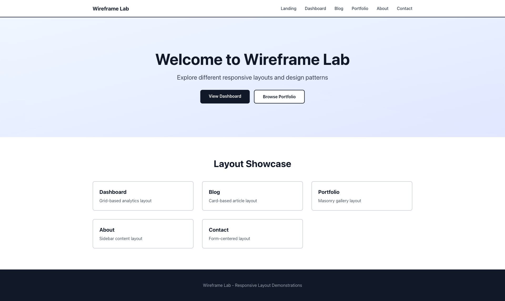
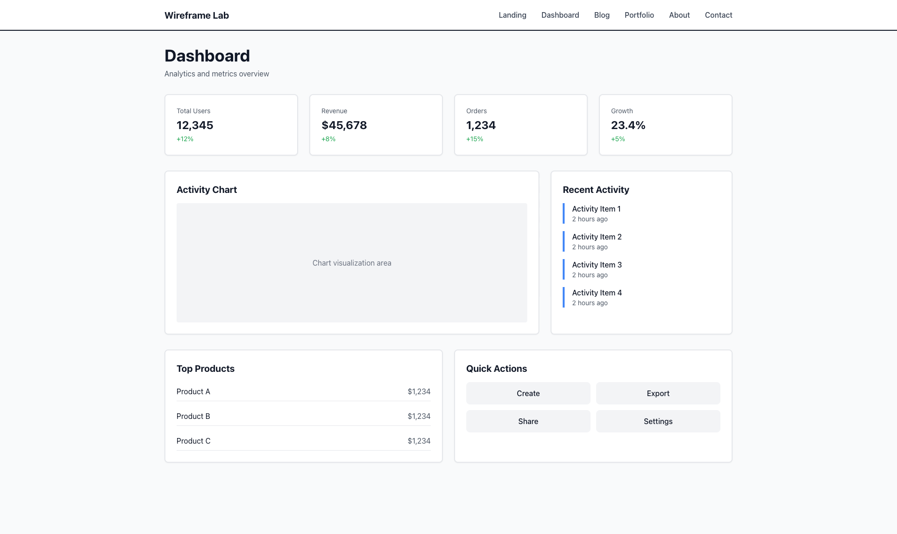
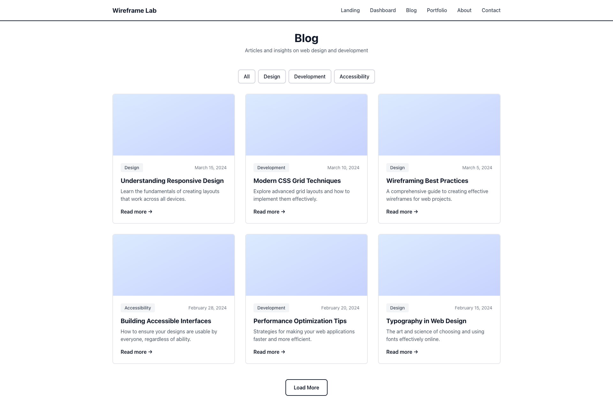
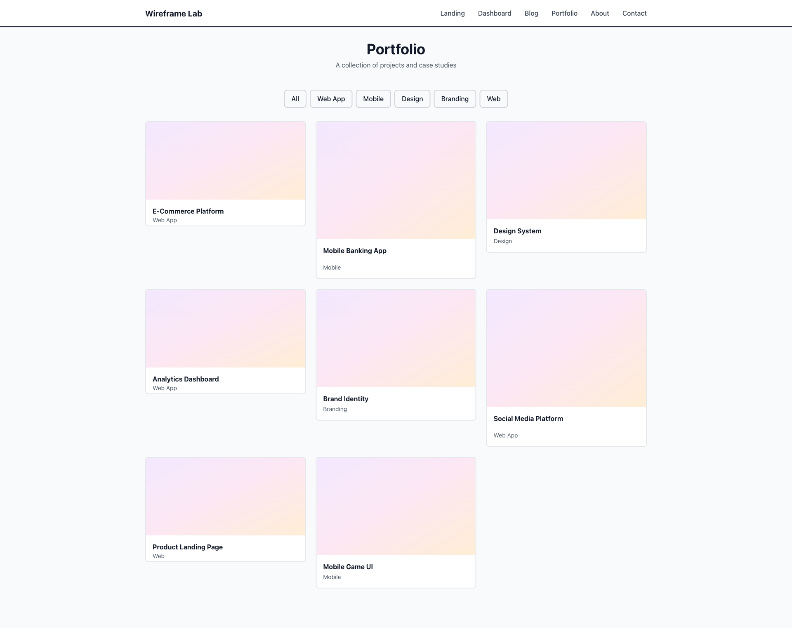
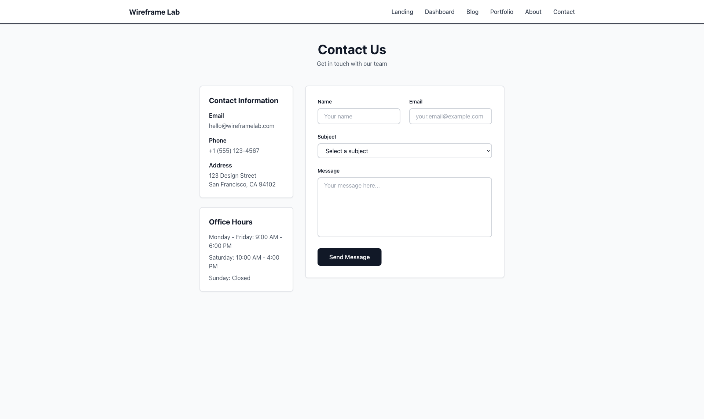

# Wireframe Lab

A high-fidelity wireframe web application showcasing different responsive layouts and design patterns. Each page demonstrates a unique layout style, all fully responsive and optimized for mobile, tablet, and desktop viewing.

> ⚡ Created in under 30 seconds with AI

## Features

- **Multiple Layout Styles**: Six different pages with unique layouts:
  - Landing Page (Hero layout)
  - Dashboard (Grid-based analytics)
  - Blog (Card-based articles)
  - Portfolio (Masonry gallery)
  - About (Sidebar content)
  - Contact (Form-centered)

- **Fully Responsive**: All layouts adapt seamlessly across:
  - Mobile devices (< 640px)
  - Tablets (640px - 1024px)
  - Desktop (> 1024px)

- **Modern Stack**: Built with Next.js 14, React, TypeScript, and Tailwind CSS

## Getting Started

### Prerequisites

- Node.js 18+ installed
- npm or yarn package manager

### Installation

1. Install dependencies:
```bash
npm install
```

2. Run the development server:
```bash
npm run dev
```

3. Open [http://localhost:3000](http://localhost:3000) in your browser

## Project Structure

```
wireframe-lab/
├── app/
│   ├── page.tsx          # Landing page
│   ├── dashboard/        # Dashboard layout
│   ├── blog/             # Blog layout
│   ├── portfolio/        # Portfolio layout
│   ├── about/            # About layout
│   ├── contact/          # Contact layout
│   ├── layout.tsx        # Root layout
│   └── globals.css       # Global styles
├── components/
│   └── Navigation.tsx    # Responsive navigation
└── ...
```

## Layout Demonstrations

### Landing Page
Hero section with call-to-action buttons and feature grid showcasing all layouts.



### Dashboard
Grid-based layout with statistics cards, charts, activity feeds, and quick actions.



### Blog
Card-based article layout with filtering, featured images, and pagination.



### Portfolio
Masonry-style gallery with varied aspect ratios and hover effects.



### About
Sidebar navigation with main content area, team grid, and value propositions.


### Contact
Form-centered layout with contact information sidebar and responsive form fields.



## Technologies

- **Next.js 14**: React framework with App Router
- **TypeScript**: Type-safe development
- **Tailwind CSS**: Utility-first CSS framework
- **React 18**: Modern React features

## Development

- `npm run dev` - Start development server
- `npm run build` - Build for production
- `npm run start` - Start production server
- `npm run lint` - Run ESLint

## License

MIT

